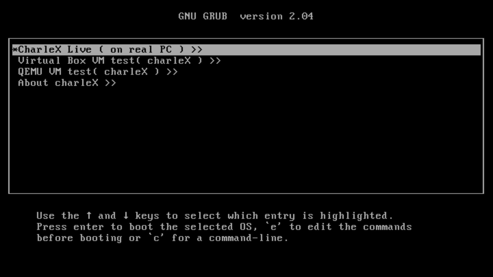
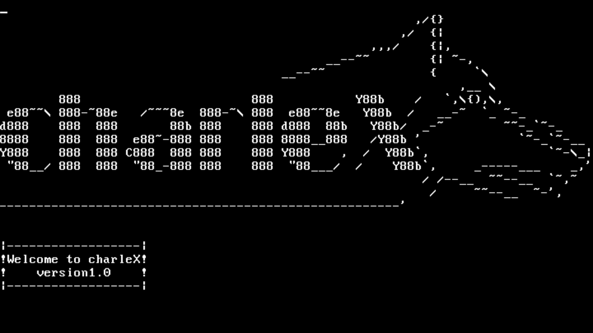
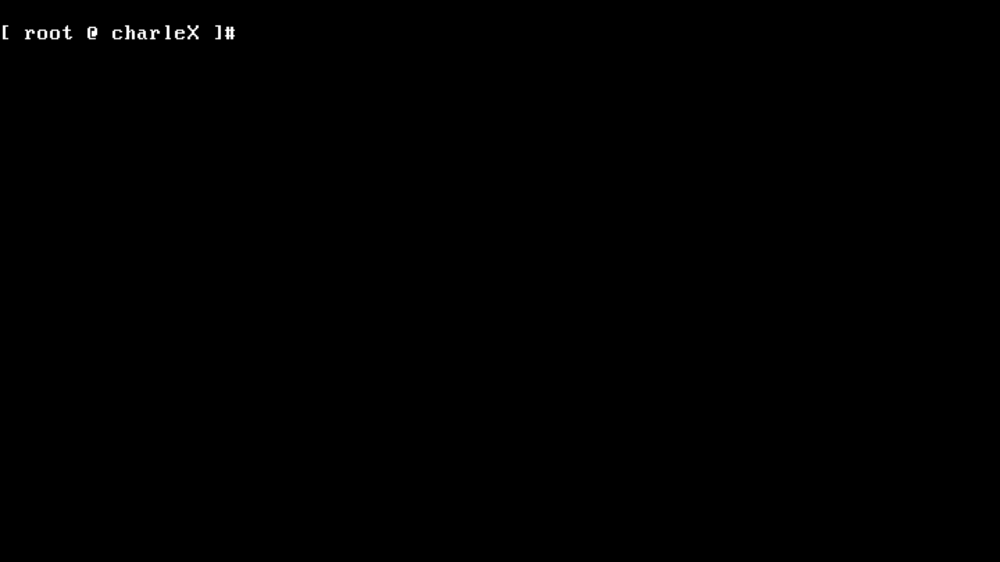

# MD5SUM :

		    7771af2382cc8b873f60ff22c8099730

# charleX OS logo :

                  %%  %%                      %%  %%      
                 %%      %%                  %%      %%   
                 %%        %%              %%        %%   
                 %%          %%%%%%%%%%%%%%          %%   
                 %%                                  %%   
                 %%                                  %%   
               %%        %%%%              %%%%        %% 
             %%          %%%%%%          %%%%%%          %%
             %%                                          %%
             %%                  %%%%%%                  %%
             %%            %%      %%      %%            %%
               %%            %%%%%%%%%%%%%%            %%  
                %%                                    %%  
                   %%                              %%      
                     %%%%%%%%              %%%%%%%%     
                             %%%%%%%%%%%%%%               

# charleX OS

charleX is a simple OS ... kernel written with c programming language and reference of this code is 'codeproject.com'.
I still working to make a better kernel than this one, and many features will be added to this project.
I wanna create the free and open-source OS like gnu/Linux, *BSD,... and you can support us. if you like this project, give a star to the project and send better code to us.

# compile and run :

$ as --32 boot.s -o boot.o
$ 
$ gcc -m32 -c kernel.c -o kernel.o -std=gnu99 -ffreestanding -O1 -Wall -Wextra
$ 
$ gcc -m32 -c about.c -o about.o -std=gnu99 -ffreestanding -O1 -Wall -Wextra
$ 
$ gcc -m32 -c virtual.c -o virtual.o -std=gnu99 -ffreestanding -O1 -Wall -Wextra
$ 
$ gcc -m32 -c qemuTestVM.c -o qemuTestVM.o -std=gnu99 -ffreestanding -O1 -Wall -Wextra
$ 
$ 
$ gcc -m32 -c utils.c -o utils.o -std=gnu99 -ffreestanding -O1 -Wall -Wextra
$ 
$ gcc -m32 -c char.c -o char.o -std=gnu99 -ffreestanding -O1 -Wall -Wextra
$ 
$ gcc -m32 -c logo.c -o logo.o -std=gnu99 -ffreestanding -O1 -Wall -Wextra
$ 
$ 
$ 
$ 
$ 
$ ld -m elf_i386 -T linker.ld kernel.o utils.o char.o logo.o boot.o -o charleX.bin -nostdlib
$ 
$ ld -m elf_i386 -T linker.ld about.o boot.o logo.o  -o   about.bin -nostdlib
$ 
$ ld -m elf_i386 -T linker.ld virtual.o utils.o char.o boot.o logo.o  -o virtual.bin -nostdlib
$ 
$ ld -m elf_i386 -T linker.ld qemuTestVM.o utils.o char.o boot.o logo.o  -o qemuTestVM.bin -nostdlib
$ 
$ 
$ 
$ 
$ grub-file --is-x86-multiboot charleX.bin
$ 
$ mkdir -p iso/boot/grub
$ 
$ mkdir -p iso/about/
$ 
$ mkdir -p iso/virtual/
$ 
$ mkdir -p iso/qemu/
$ 
$ 
$ cp charleX.bin iso/boot/charleX.bin
$ 
$ cp about.bin iso/about/about.bin
$ 
$ cp virtual.bin iso/virtual/virtual.bin
$ 
$ cp qemuTestVM.bin iso/qemu/qemuTestVM.bin
$ 
$ cp grub.cfg iso/boot/grub/grub.cfg
$ 
$ grub-mkrescue -o charleX.iso iso
$ 
$ rm *.o *.bin
$ 
$ qemu-system-i386 charleX.iso

# Automatic compile and run

$ chmod +x run.sh

$ ./run.sh

# GCC Cross Compiler :

$ chmod +x ./gccCrossCompiler

$./gccCrossComplier

# report bug or problems

send bug or anythings : amzy0zone@gmail.com

thanks for reading this ! :)
