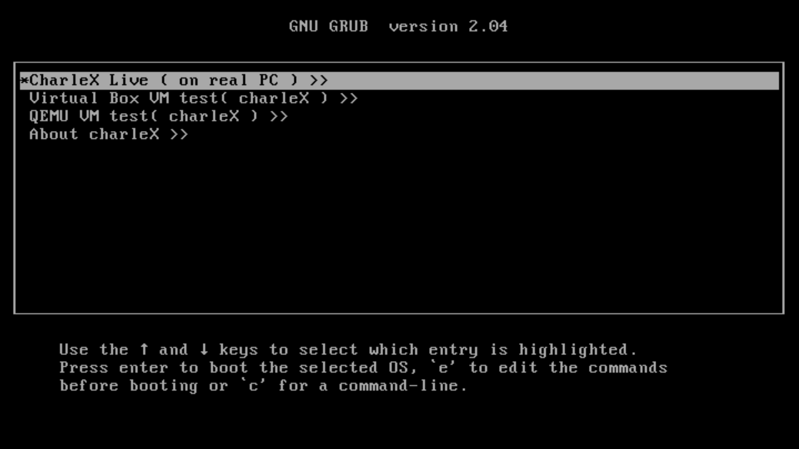
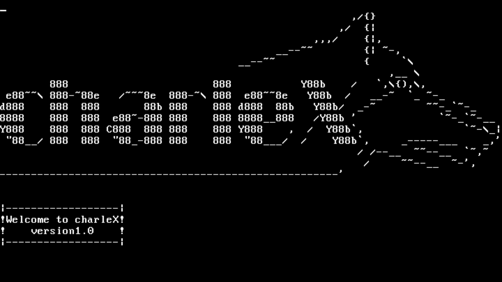
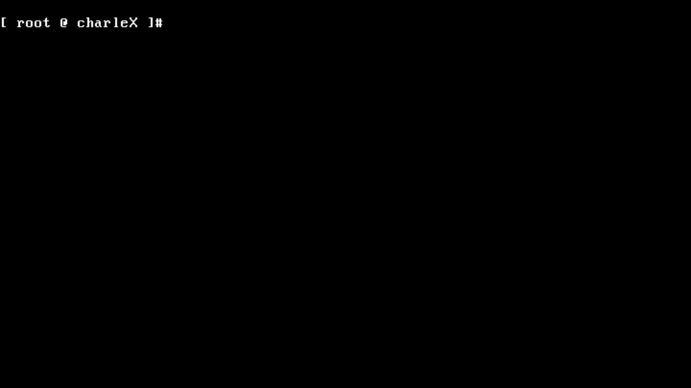

# charleX OS logo :

                  %%  %%                      %%  %%      
                 %%      %%                  %%      %%   
                 %%        %%              %%        %%   
                 %%          %%%%%%%%%%%%%%          %%   
                 %%                                  %%   
                 %%                                  %%   
               %%        %%%%              %%%%        %% 
             %%          %%%%%%          %%%%%%          %%
             %%                                          %%
             %%                  %%%%%%                  %%
             %%            %%      %%      %%            %%
               %%            %%%%%%%%%%%%%%            %%  
                %%                                    %%  
                   %%                              %%      
                     %%%%%%%%              %%%%%%%%     
                             %%%%%%%%%%%%%%               

# charleX OS

CharleX is a simple and fast operating system. The kernel is written in C. I am adding new features to make it better. The goal is to make a free, open-source OS like Linux and FreeBSD. You can help by giving code or starring the project.

.png) [2025]

# New Features in usr/shell.h Version 0.2

- The terminal scrolls when text reaches the bottom.
- Input handling is faster and more correct.
- Backspace erases characters properly.
- Special keys (UP, DOWN, TAB, ESC) show messages.
- Clear screen function is faster.
- Version updated to 0.2.

# compile and run :
	$ make mkiso 

# OS and GCC dependencies(Debian/Ubuntu):
	$ make deps
